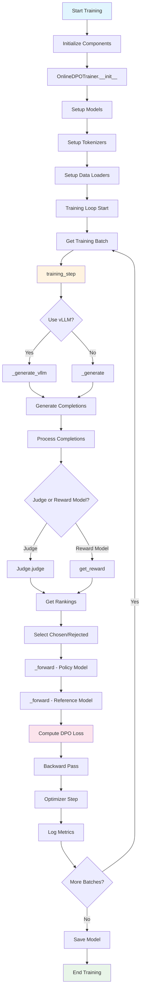

# Online DPO Training Workflow - Detailed Function Call Sequence

This document provides a comprehensive overview of the Online DPO training workflow, including all function calls, their interactions, and the complete training pipeline. Online DPO (Direct Preference Optimization) enables training language models using online feedback from AI judges or reward models.

For visual representations of this workflow, see the [Online DPO Workflow Diagrams](online_dpo_workflow_diagrams.md).

For a practical example with detailed logging, see [`examples/scripts/online_dpo_workflow_example.py`](https://github.com/huggingface/trl/blob/main/examples/scripts/online_dpo_workflow_example.py).

## Overview

Online DPO training involves the following key phases:
1. **Initialization**: Setup of models, tokenizers, and training components
2. **Training Loop**: Iterative generation, scoring, and optimization
3. **Generation**: Creating completions for prompts using the current model
4. **Scoring**: Evaluating and ranking completions using reward models or judges
5. **Loss Computation**: Computing DPO loss between chosen and rejected completions
6. **Optimization**: Gradient computation and parameter updates
7. **Logging**: Tracking metrics and training progress

## Complete Training Workflow



## Detailed Function Call Sequence

### 1. Initialization Phase

#### 1.1 Trainer Initialization

```python
trainer = OnlineDPOTrainer(
    model=model,                          # Policy model to train
    ref_model=ref_model,                  # Reference model (optional)
    reward_model=reward_model,            # Reward model (optional)
    judge=judge,                          # Judge for scoring (optional)
    args=training_args,                   # OnlineDPOConfig
    train_dataset=train_dataset,          # Training prompts
    eval_dataset=eval_dataset,            # Evaluation prompts
    processing_class=tokenizer,           # Main tokenizer
    reward_processing_class=reward_tokenizer,  # Reward model tokenizer
    peft_config=peft_config              # PEFT configuration
)
```

**Key Function Calls in `__init__`:**

1. **Model Setup**:
   ```python
   # Disable dropout if specified
   if args.disable_dropout:
       disable_dropout_in_model(model)
       if self.ref_model is not None:
           disable_dropout_in_model(self.ref_model)
   
   # Create reference model if not provided
   if ref_model is None and peft_config is None:
       self.ref_model = create_reference_model(model)
   
   # Setup reward model
   if self.reward_model is not None:
       self.reward_model.eval()
   ```

2. **Generation Configuration**:
   ```python
   if args.use_vllm:
       # vLLM configuration
       self.generation_config = SamplingParams(
           n=2,
           max_tokens=args.max_new_tokens,
           temperature=args.temperature,
           top_k=50,
           top_p=1.0,
           detokenize=False
       )
       self.llm = LLM(model=model.name_or_path, ...)
   else:
       # Standard generation configuration
       self.generation_config = GenerationConfig(
           max_new_tokens=args.max_new_tokens,
           temperature=args.temperature,
           top_k=50,
           top_p=1.0,
           do_sample=True,
           use_cache=False if args.gradient_checkpointing else True
       )
   ```

3. **Data Collator Setup**:
   ```python
   if data_collator is None:
       data_collator = DPODataCollatorWithPadding(
           pad_token_id=processing_class.pad_token_id
       )
   ```

#### 1.2 Model Device Placement

```python
# Move models to appropriate devices
if self.is_deepspeed_enabled:
    if self.reward_model is not None:
        self.reward_model = prepare_deepspeed(
            self.reward_model, args.per_device_train_batch_size, args.fp16, args.bf16
        )
    if self.ref_model is not None:
        self.ref_model = prepare_deepspeed(
            self.ref_model, args.per_device_train_batch_size, args.fp16, args.bf16
        )
else:
    if self.ref_model is not None:
        self.ref_model = self.ref_model.to(self.accelerator.device)
    if self.reward_model is not None:
        self.reward_model = self.reward_model.to(self.accelerator.device)
```

### 2. Training Loop

#### 2.1 Main Training Step

```python
def training_step(self, model, inputs, num_items_in_batch=None):
    model.train()
    
    prompts = inputs["prompt"]
    batch_size = len(prompts)
    
    # Step 1: Generate completions
    if self.args.use_vllm:
        prompt_ids, prompt_mask, completion_ids, completion_mask = self._generate_vllm(model, inputs)
    else:
        prompt_ids, prompt_mask, completion_ids, completion_mask = self._generate(model, inputs)
    
    # Step 2: Check for EOS tokens
    contain_eos_token = torch.any(
        completion_ids == self.processing_class.eos_token_id, dim=-1
    )
    
    # Step 3: Forward pass through policy model
    logprobs = self._forward(model, prompt_ids, prompt_mask, completion_ids, completion_mask)
    
    # Step 4: Forward pass through reference model
    with torch.no_grad():
        if self.ref_model is not None:
            ref_logprobs = self._forward(
                self.ref_model, prompt_ids, prompt_mask, completion_ids, completion_mask
            )
        else:  # PEFT case
            with self.model.disable_adapter():
                ref_logprobs = self._forward(
                    self.model, prompt_ids, prompt_mask, completion_ids, completion_mask
                )
    
    # Step 5: Decode completions and get rewards
    completions = self.processing_class.batch_decode(completion_ids, skip_special_tokens=True)
    
    # Step 6: Score completions
    if self.judge is not None:
        ranks = self.judge.judge(prompts, list(zip(completions[:batch_size], completions[batch_size:])))
        mask = torch.tensor([rank == 0 for rank in ranks], device=device)
    else:
        # Use reward model
        scores = self._score_with_reward_model(prompts, completions, ...)
        first_half, second_half = scores.split(batch_size)
        mask = first_half >= second_half
    
    # Step 7: Identify chosen and rejected completions
    chosen_indices = batch_range + (~mask * batch_size)
    rejected_indices = batch_range + (mask * batch_size)
    
    # Step 8: Compute DPO loss
    loss = self._compute_dpo_loss(logprobs, ref_logprobs, chosen_indices, rejected_indices, ...)
    
    # Step 9: Backward pass
    self.accelerator.backward(loss)
    
    return loss.detach() / self.args.gradient_accumulation_steps
```

### 3. Generation Phase

#### 3.1 Standard Generation

```python
def _generate(self, model, inputs):
    eos_token_id = self.processing_class.eos_token_id
    pad_token_id = self.processing_class.pad_token_id
    
    # Process inputs for generation
    prompt_ids, prompt_mask, additional_inputs = self._process_inputs_for_generation(inputs)
    
    # Generate with unwrapped model
    with unwrap_model_for_generation(
        model, self.accelerator, gather_deepspeed3_params=self.args.ds3_gather_for_generation
    ) as unwrapped_model:
        output = unwrapped_model.generate(
            input_ids=prompt_ids,
            attention_mask=prompt_mask,
            generation_config=self.generation_config,
            **additional_inputs
        )
    
    # Extract and process completions
    completion_ids = output[:, prompt_ids.size(1):]
    completion_ids, completion_mask = truncate_right(completion_ids, eos_token_id, pad_token_id)
    
    return prompt_ids, prompt_mask, completion_ids, completion_mask
```

#### 3.2 vLLM Generation

```python
def _generate_vllm(self, model, inputs):
    eos_token_id = self.processing_class.eos_token_id
    pad_token_id = self.processing_class.pad_token_id
    
    # Load latest weights into vLLM
    llm_model = self.llm.llm_engine.model_executor.driver_worker.model_runner.model
    llm_model.load_weights(model.state_dict().items())
    
    # Prepare prompts for generation
    generation_prompts = self._prepare_prompts_for_generation(inputs)
    
    # Generate using vLLM
    outputs = self.llm.generate(generation_prompts, self.generation_config, use_tqdm=False)
    
    # Process outputs
    completion_ids = [list(output.outputs[i].token_ids) for i in range(2) for output in outputs]
    prompt_ids = [list(output.prompt_token_ids) for _ in range(2) for output in outputs]
    
    # Create masks and pad sequences
    # ... (detailed padding and masking logic)
    
    return prompt_ids, prompt_mask, completion_ids, completion_mask
```

### 4. Scoring Phase

#### 4.1 Judge-based Scoring

```python
# Judge scoring workflow
if self.judge is not None:
    # Format conversational data if needed
    if is_conversational({"prompt": prompts[0]}):
        environment = jinja2.Environment()
        template = environment.from_string(SIMPLE_CHAT_TEMPLATE)
        prompts = [template.render(messages=prompt) for prompt in prompts]
        completions = [template.render(messages=completion) for completion in completions]
    
    # Get rankings from judge
    ranks_of_first_completion = self.judge.judge(
        prompts, list(zip(completions[:batch_size], completions[batch_size:]))
    )
    
    # Convert ranks to binary mask
    mask = torch.tensor([rank == 0 for rank in ranks_of_first_completion], device=device)
```

#### 4.2 Reward Model Scoring

```python
# Reward model scoring workflow
else:
    # Prepare prompts and completions
    prompts = 2 * prompts  # Duplicate prompts
    
    # Apply chat template if conversational
    if is_conversational({"prompt": prompts[0]}):
        examples = [{"prompt": p, "completion": c} for p, c in zip(prompts, completions)]
        examples = [apply_chat_template(example, self.reward_processing_class) for example in examples]
        prompts = [example["prompt"] for example in examples]
        completions = [example["completion"] for example in examples]
    
    # Tokenize inputs
    prompts_ids = self.reward_processing_class(
        prompts, padding=True, return_tensors="pt", padding_side="left"
    )["input_ids"].to(device)
    
    completions_ids = self.reward_processing_class(
        completions, padding=True, return_tensors="pt", padding_side="right"
    )["input_ids"].to(device)
    
    # Concatenate and score
    prompt_completion_ids = torch.cat((prompts_ids, completions_ids), dim=1)
    
    with torch.inference_mode():
        _, scores, _ = get_reward(
            self.reward_model, prompt_completion_ids, 
            self.reward_processing_class.pad_token_id, context_length
        )
        
        # Apply EOS penalty if configured
        if self.args.missing_eos_penalty is not None:
            scores[~contain_eos_token] -= self.args.missing_eos_penalty
    
    # Determine preferences
    first_half, second_half = scores.split(batch_size)
    mask = first_half >= second_half
```

### 5. Loss Computation

#### 5.1 Forward Pass Through Models

```python
def _forward(self, model, prompt_ids, prompt_mask, completion_ids, completion_mask):
    # Truncate if sequence too long
    num_tokens_to_truncate = max(
        prompt_ids.size(1) + completion_ids.size(1) - self.max_length, 0
    )
    prompt_ids = prompt_ids[:, num_tokens_to_truncate:]
    prompt_mask = prompt_mask[:, num_tokens_to_truncate:]
    
    # Concatenate prompt and completion
    prompt_completion_ids = torch.cat((prompt_ids, completion_ids), dim=1)
    prompt_completion_mask = torch.cat((prompt_mask, completion_mask), dim=1)
    
    # Forward pass
    output = model(prompt_completion_ids, attention_mask=prompt_completion_mask)
    
    # Extract logits for completion tokens (with offset)
    logits = output.logits[:, prompt_ids.size(1) - 1 : -1]
    
    # Compute log probabilities
    logprobs = torch.take_along_dim(
        logits.log_softmax(dim=-1), completion_ids.unsqueeze(-1), dim=2
    ).squeeze(-1)
    
    return logprobs
```

#### 5.2 DPO Loss Calculation

```python
# Organize chosen and rejected completions
cr_indices = torch.cat((chosen_indices, rejected_indices), dim=0)
cr_logprobs = logprobs[cr_indices]
cr_ref_logprobs = ref_logprobs[cr_indices]

# Mask padding tokens
padding_mask = ~completion_mask.bool()
cr_padding_mask = padding_mask[cr_indices]

# Sum log probabilities
cr_logprobs_sum = (cr_logprobs * ~cr_padding_mask).sum(1)
cr_ref_logprobs_sum = (cr_ref_logprobs * ~cr_padding_mask).sum(1)

# Split chosen and rejected
chosen_logprobs_sum, rejected_logprobs_sum = torch.split(cr_logprobs_sum, batch_size)
chosen_ref_logprobs_sum, rejected_ref_logprobs_sum = torch.split(cr_ref_logprobs_sum, batch_size)

# Compute log ratios
pi_logratios = chosen_logprobs_sum - rejected_logprobs_sum
ref_logratios = chosen_ref_logprobs_sum - rejected_ref_logprobs_sum
logits = pi_logratios - ref_logratios

# Compute loss based on type
if self.args.loss_type == "sigmoid":
    losses = -F.logsigmoid(self.beta * logits)
elif self.args.loss_type == "ipo":
    losses = (logits - 1 / (2 * self.beta)) ** 2

loss = losses.mean()
```

### 6. Metrics and Logging

#### 6.1 Training Metrics Collection

```python
# Reward model metrics
if self.reward_model is not None:
    scores_margin = scores[chosen_indices] - scores[rejected_indices]
    self.stats["objective/scores_margin"].append(
        self.accelerator.gather_for_metrics(scores_margin.mean()).mean().item()
    )
    self.stats["objective/scores"].append(
        self.accelerator.gather_for_metrics(scores.mean()).mean().item()
    )

# KL divergence and entropy
kl = logprobs - ref_logprobs
mean_kl = kl.sum(1).mean()
self.stats["objective/kl"].append(
    self.accelerator.gather_for_metrics(mean_kl).mean().item()
)

mean_entropy = -logprobs.sum(1).mean()
self.stats["objective/entropy"].append(
    self.accelerator.gather_for_metrics(mean_entropy).mean().item()
)

# Reward calculations
chosen_rewards = self.beta * (chosen_logprobs_sum - chosen_ref_logprobs_sum)
rejected_rewards = self.beta * (rejected_logprobs_sum - rejected_ref_logprobs_sum)

# Margins and accuracies
margin = gathered_chosen_rewards - gathered_rejected_rewards
accuracy = margin > 0

self.stats["rewards/margins"].append(margin.mean().item())
self.stats["rewards/accuracies"].append(accuracy.float().mean().item())
```

#### 6.2 Logging Integration

```python
def _maybe_log_save_evaluate(self, tr_loss, grad_norm, model, trial, epoch, ignore_keys_for_eval, start_time, learning_rate=None):
    if self.control.should_log and self.state.global_step > self._globalstep_last_logged:
        logs = {}
        
        # Standard training metrics
        tr_loss_scalar = self._nested_gather(tr_loss).mean().item()
        logs["loss"] = round(tr_loss_scalar / (self.state.global_step - self._globalstep_last_logged), 4)
        
        # Add Online DPO specific metrics
        for key, val in self.stats.items():
            logs[key] = sum(val) / len(val)
        
        # Reset stats for next logging period
        self.stats = {key: [] for key in self.stats}
        
        self.log(logs, start_time)
```

## Key Configuration Parameters

### OnlineDPOConfig Parameters

| Parameter | Type | Default | Description |
|-----------|------|---------|-------------|
| `max_new_tokens` | int | 64 | Maximum tokens to generate per completion |
| `max_length` | int | 512 | Maximum total sequence length |
| `temperature` | float | 0.9 | Sampling temperature |
| `beta` | float/list | 0.1 | KL divergence penalty coefficient |
| `loss_type` | str | "sigmoid" | Loss function type ("sigmoid" or "ipo") |
| `missing_eos_penalty` | float | None | Penalty for missing EOS tokens |
| `use_vllm` | bool | False | Whether to use vLLM for generation |
| `disable_dropout` | bool | True | Whether to disable dropout |

## Usage Examples

### Basic Usage with Judge

```python
from trl import OnlineDPOTrainer, OnlineDPOConfig, PairRMJudge
from transformers import AutoModelForCausalLM, AutoTokenizer
from datasets import load_dataset

# Initialize components
model = AutoModelForCausalLM.from_pretrained("Qwen/Qwen2-0.5B-Instruct")
tokenizer = AutoTokenizer.from_pretrained("Qwen/Qwen2-0.5B-Instruct")
judge = PairRMJudge()
dataset = load_dataset("trl-lib/ultrafeedback-prompt", split="train")

# Configure training
config = OnlineDPOConfig(
    output_dir="./online-dpo-output",
    max_new_tokens=128,
    beta=0.1,
    learning_rate=5e-7,
    per_device_train_batch_size=4,
    num_train_epochs=1
)

# Initialize trainer
trainer = OnlineDPOTrainer(
    model=model,
    judge=judge,
    args=config,
    processing_class=tokenizer,
    train_dataset=dataset
)

# Start training
trainer.train()
```

### Usage with Reward Model

```python
from transformers import AutoModelForSequenceClassification

# Load reward model and tokenizer
reward_model = AutoModelForSequenceClassification.from_pretrained(
    "trl-lib/Qwen2-0.5B-Reward", num_labels=1
)
reward_tokenizer = AutoTokenizer.from_pretrained("trl-lib/Qwen2-0.5B-Reward")

# Initialize trainer with reward model
trainer = OnlineDPOTrainer(
    model=model,
    reward_model=reward_model,
    reward_processing_class=reward_tokenizer,
    args=config,
    processing_class=tokenizer,
    train_dataset=dataset
)

trainer.train()
```

### Usage with vLLM

```python
config = OnlineDPOConfig(
    output_dir="./online-dpo-vllm",
    use_vllm=True,
    gpu_memory_utilization=0.55,
    max_new_tokens=128
)

trainer = OnlineDPOTrainer(
    model=model,
    judge=judge,
    args=config,
    processing_class=tokenizer,
    train_dataset=dataset
)

trainer.train()
```

## Performance Optimizations

### Memory Optimization

1. **Gradient Checkpointing**: Enable with `gradient_checkpointing=True`
2. **DeepSpeed Integration**: Automatic handling of DeepSpeed ZeRO stages
3. **vLLM Integration**: Faster generation with `use_vllm=True`
4. **Truncation Strategy**: Left truncation to preserve completion quality

### Training Stability

1. **Dropout Disable**: Default behavior to stabilize training
2. **EOS Penalty**: Encourage proper completion termination
3. **Reference Model Caching**: Efficient KL computation
4. **Gradient Accumulation**: Support for large effective batch sizes

This comprehensive workflow documentation provides all the details needed to understand and implement Online DPO training, including every function call and their interactions throughout the training process.