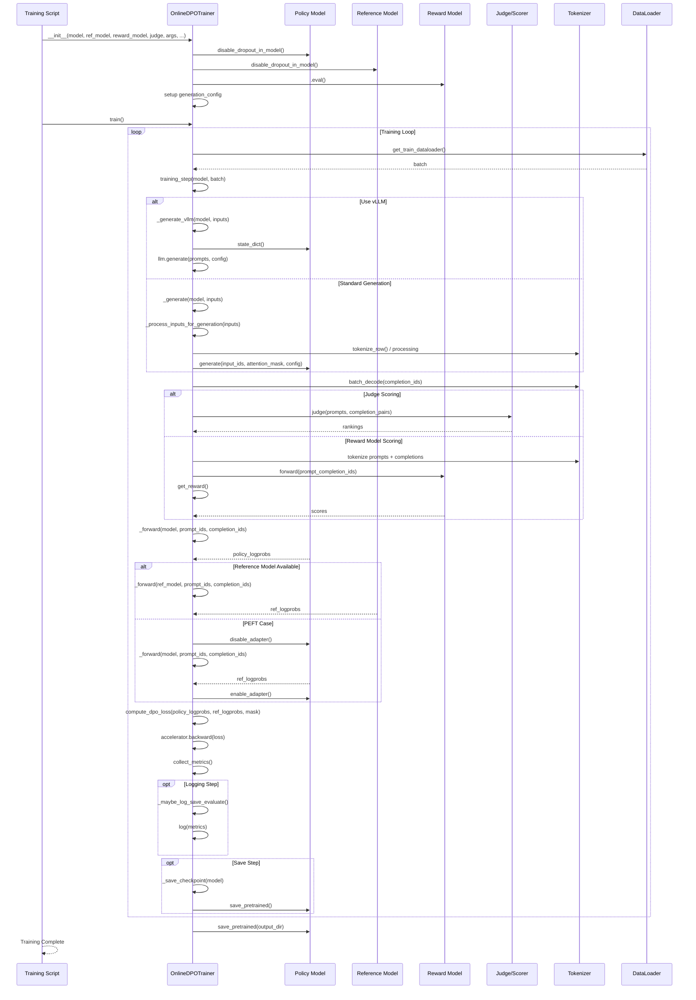
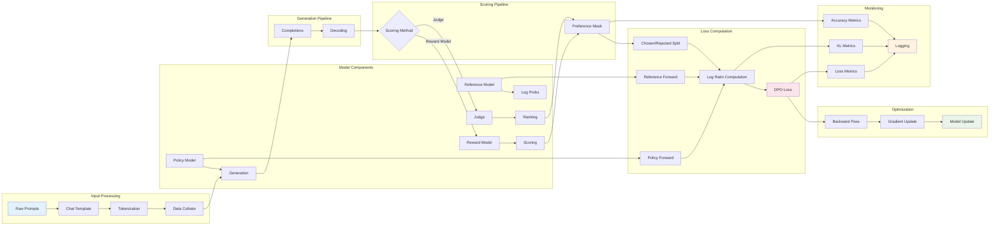
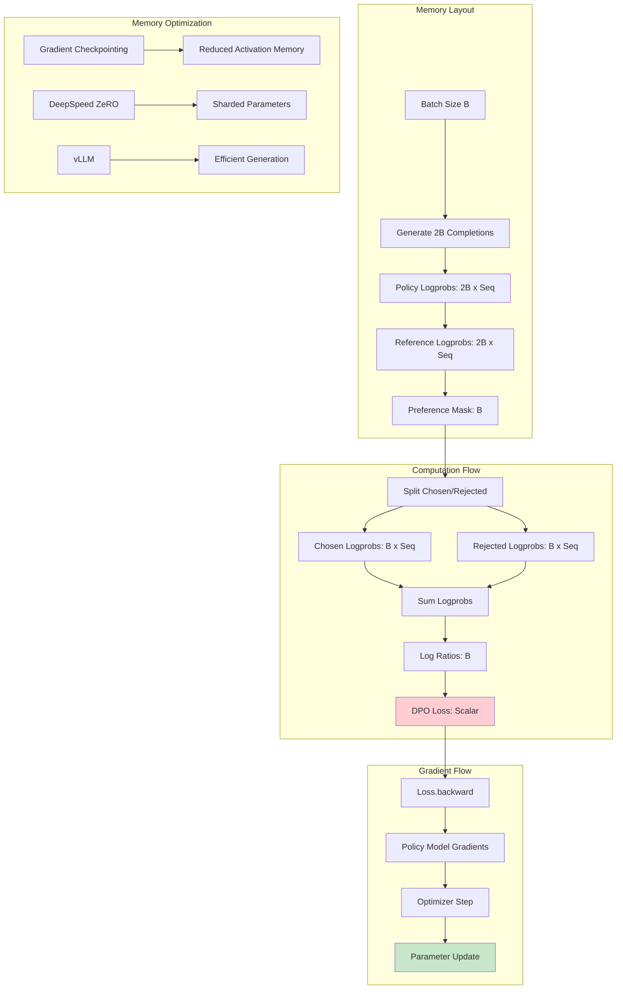
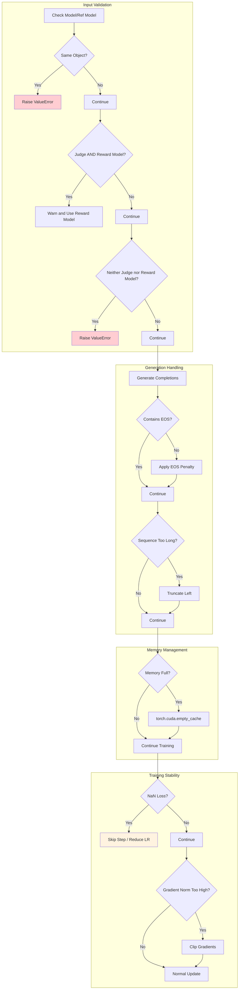
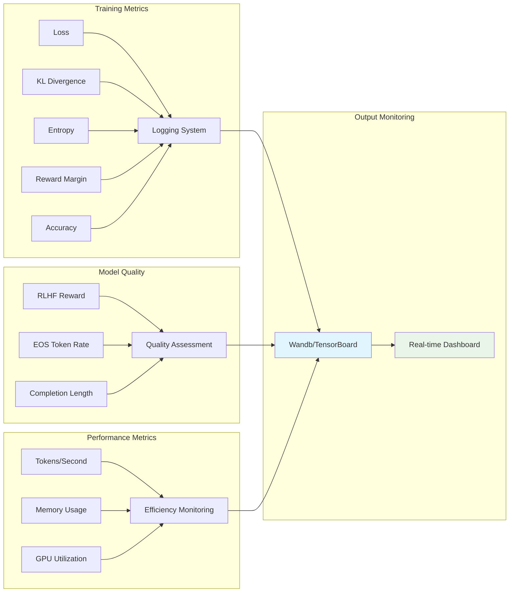

# Online DPO Training Workflow - Complete Mermaid Diagrams

This document contains comprehensive mermaid diagrams visualizing the Online DPO training workflow with detailed function calls.

## Main Training Workflow

```mermaid
graph TB
    subgraph "Initialization Phase"
        A[Start Training] --> B[OnlineDPOTrainer.__init__]
        B --> C[Setup Policy Model]
        C --> D[Setup Reference Model]
        D --> E[Setup Reward Model/Judge]
        E --> F[Setup Tokenizers]
        F --> G[Setup Data Loaders]
        G --> H[Configure Generation]
    end
    
    subgraph "Training Loop"
        H --> I[trainer.train]
        I --> J[Get Training Batch]
        J --> K[training_step]
    end
    
    subgraph "Generation Phase"
        K --> L{Use vLLM?}
        L -->|Yes| M[_generate_vllm]
        L -->|No| N[_generate]
        
        M --> O[Load Latest Weights]
        O --> P[LLM.generate]
        P --> Q[Process vLLM Outputs]
        
        N --> R[_process_inputs_for_generation]
        R --> S[unwrap_model_for_generation]
        S --> T[model.generate]
        T --> U[truncate_right]
    end
    
    subgraph "Scoring Phase"
        Q --> V[Decode Completions]
        U --> V
        V --> W{Judge or Reward Model?}
        
        W -->|Judge| X[Apply Chat Template]
        X --> Y[judge.judge]
        Y --> Z[Convert Ranks to Mask]
        
        W -->|Reward Model| AA[Tokenize Prompts+Completions]
        AA --> BB[Concat Sequences]
        BB --> CC[get_reward]
        CC --> DD[Apply EOS Penalty]
        DD --> EE[Compare Scores]
    end
    
    subgraph "Loss Computation"
        Z --> FF[Select Chosen/Rejected]
        EE --> FF
        FF --> GG[_forward - Policy Model]
        GG --> HH[_forward - Reference Model]
        HH --> II[Compute Log Ratios]
        II --> JJ[Compute DPO Loss]
    end
    
    subgraph "Optimization"
        JJ --> KK[accelerator.backward]
        KK --> LL[optimizer.step]
        LL --> MM[scheduler.step]
    end
    
    subgraph "Logging & Control"
        MM --> NN[Collect Metrics]
        NN --> OO[_maybe_log_save_evaluate]
        OO --> PP{More Batches?}
        PP -->|Yes| J
        PP -->|No| QQ{More Epochs?}
        QQ -->|Yes| I
        QQ -->|No| RR[Save Final Model]
        RR --> SS[End Training]
    end
    
    style A fill:#e1f5fe
    style SS fill:#e8f5e8
    style K fill:#fff3e0
    style JJ fill:#fce4ec
    style P fill:#f3e5f5
    style T fill:#f3e5f5
```

## Detailed Function Call Sequence

## Component Interaction Diagram

## Memory and Computation Flow

## Error Handling and Edge Cases

## Performance Monitoring

These diagrams provide a complete visual representation of the Online DPO training workflow, covering all aspects from initialization through optimization, including error handling and performance monitoring.